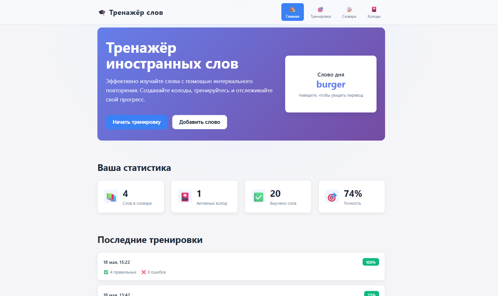
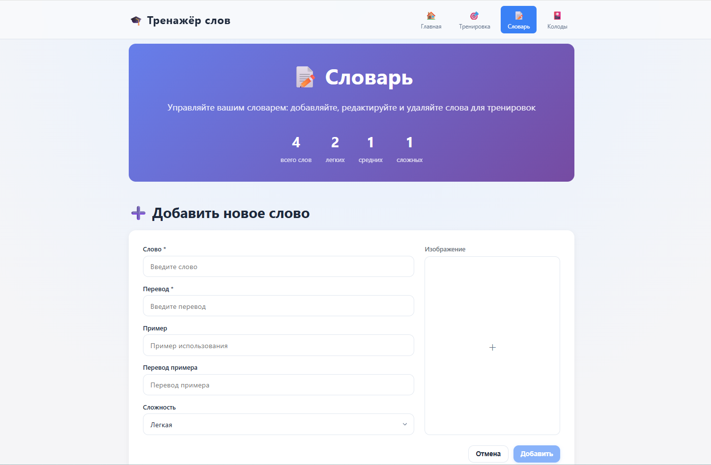
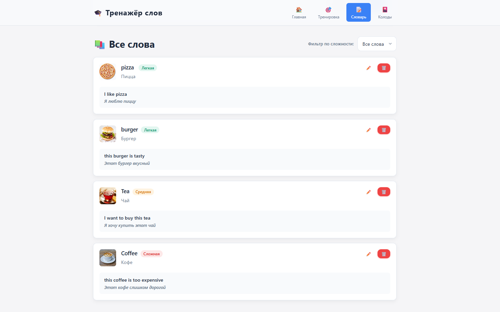
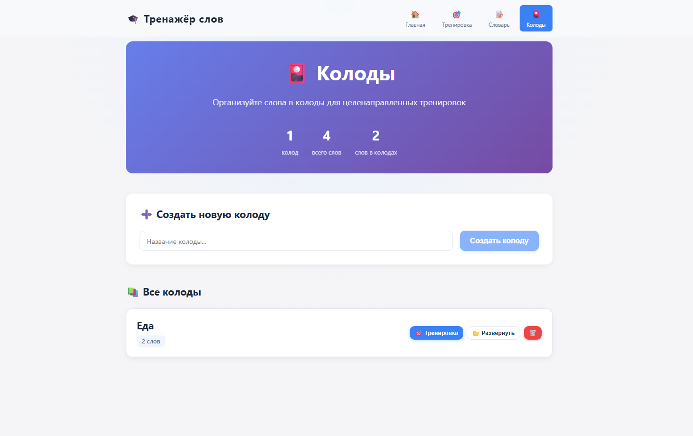
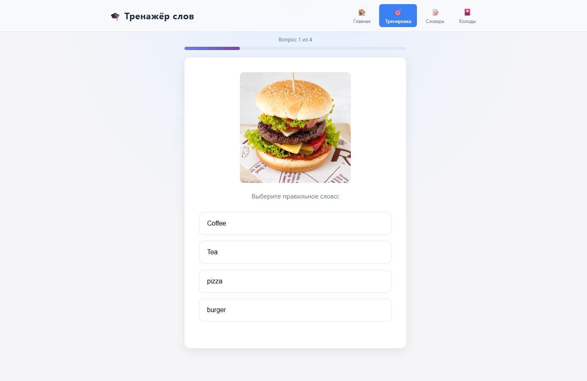

# Glossly — тренажёр для изучения иностранных слов

Веб-приложение для изучения иностранных слов. Персональный словарь, колоды по темам, тренировки с вариантами ответа и интервальное повторение по алгоритму SM-2.

**Авторы:** [@asfkam1ru-hub](https://github.com/asfkam1ru-hub), [@Alephod](https://github.com/Alephod)

---

## О проекте

Glossly состоит из React-фронтенда и Flask-бэкенда с SQLite. Основные разделы:

- **Главная** — статистика, история тренировок, виджет «слово дня»
- **Словарь** — CRUD слов (термин, перевод, пример, сложность, изображение)
- **Колоды** — группировка слов, тренировка по выбранной колоде
- **Тренировка** — вопросы «слово → перевод», «перевод → слово», «картинка → слово» и обратные варианты; слова с наступившей датой повторения подбираются через SM-2

**Стек**


---

## Скриншоты

| Главная |
|---------|
|  |

| Словарь |
|---------|
|  |
|  |

| Колоды |
|---------|
|  |

| Тренировка |
|---------|
|  |

---

## Запуск

### Docker

```bash
git clone <url-репозитория>
cd TermPaper
```

Файл `.env` в корне:

```env
FLASK_CONFIG=production
DATABASE_URL=sqlite:///database.db

VITE_API_URL=http://localhost:5000

BACKEND_PORT=5000
FRONTEND_PORT=4173
```

```bash
docker compose up --build
```

| Сервис | URL |
|--------|-----|
| Frontend | http://localhost:4173 |
| Backend API | http://localhost:5000/api |

При первом запуске backend применяет миграции БД.

### Локальная разработка

**Backend**

```bash
cd backend
python -m venv venv
venv\Scripts\activate          # Windows
# source venv/bin/activate     # macOS / Linux
pip install -r requirements.txt
flask db upgrade
python run.py
```


**Frontend**

```bash
cd frontend
npm install
```

Файл `frontend/.env`:

```env
VITE_API_URL=http://localhost:5000
```

```bash
npm run dev
```

---

## Структура

```
TermPaper/
├── backend/          # Flask API, SM-2, миграции
├── frontend/         # React SPA
├── docs/screenshots/ # скриншоты для README
└── docker-compose.yml
```
